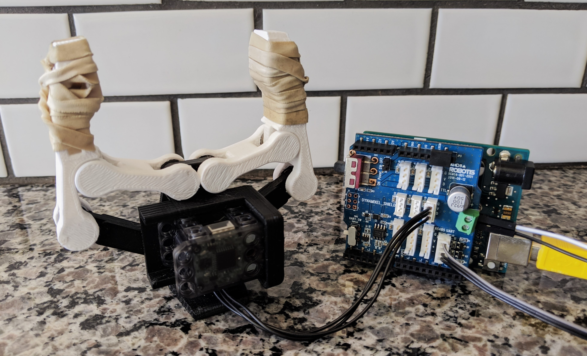
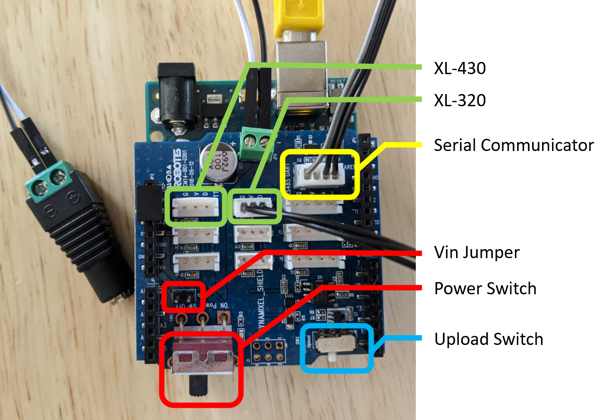

# dynamixel-shield-toolbox


Though the Dynamixel Shield seems to offer an attractive way to control Dynamixel servos on the familiar Arduino platform, in its current early stages of development I feel that the hardware is suffering for lack of software support. Moreover, confusing documentation and a couple of hidden quirks make the shield frustratingly difficult for beginners to familiarize themselves with. This repo goes over the basics of setting up the shield from the perspective of someone who's already struggled through the process, and will (hopefully) get you up and running with the shield in a few easy steps.

Note that the Dynamixel Shield is relatively new and as such it is evolving constantly. Please see the [ROBOTIS eManual](https://emanual.robotis.com/docs/en/parts/interface/dynamixel_shield/) for up-to-date information.

## 1. Before You Buy

Make sure that the shield is right for your project.

* Make sure the motor(s) you want to use is on the list of [supported motors](https://emanual.robotis.com/docs/en/parts/interface/dynamixel_shield/#supported-dynamixel).
	* Note that the shield only has one power connector so you may not be able to use two or more different motors if they have different power requirements. 
* Make sure you have the right Arduino, or are willing to buy some additional hardware. Some Arduinos (Uno, Nano, Mini, and Mega) require additional serial communicators in order to [communicate over serial](https://emanual.robotis.com/docs/en/parts/interface/dynamixel_shield/#how-to-use-serial-monitor-with-dynamixel-shield).

I'm using the following hardware, which I've found works pretty well.
* [Dynamixel Shield](http://www.robotis.us/dynamixel-shield/) (obviously).
* [Arduino UNO](https://store.arduino.cc/usa/arduino-uno-rev3) (or a copycat board).
* [LN-101 Serial Communicator](http://www.robotis.us/usb-downloader-ln-101_int/) (this is only required for Uno, Nano, Mini, Mega).
* 2x [Dynamixel XL-320](http://www.robotis.us/dynamixel-xl-320/).
* 2x [Dynamixel XL-430](http://www.robotis.us/dynamixel-xl430-w250-t/).
* [7.5V 3A variable power supply](https://www.amazon.com/gp/product/B01MT5WVCG/ref=ppx_yo_dt_b_asin_title_o03_s00?ie=UTF8&psc=1) (optionally with female barrel connector).
* A short length of copper wire (you'll either need this, or you'll need the resolve to snip and strip your power supply).

The serial communicator is necessary in order to send commands to, or read output from, boards that share their serial port with USB (specifically the Uno, Nano, Mini, and Mega, see [Arduino Serial](https://www.arduino.cc/reference/en/language/functions/communication/serial/)). I tried a few different tactics to get around having to buy it but in the end it's by far the [most hassle free option](http://en.robotis.com/service/forum_view.php?bbs_no=2407675&page=1&save_sca=&sca=&save_stx=shield&stx=shield&sfl=wr_subject||wr_content), and it's what I would recommend if you want to use this shield with any of the above mentioned boards. Note also that the two types of Dynamixels (XL-320 and XL-430) I'm using have pretty similar recommended voltage ranges so I'm able to power all of the motors using a single 7.5V power supply. See your motor's spec sheet for its recommended operating voltage range.

## 2. Setup

### 2.1 Hardware

Install the shield on the arduino, and ensure that the shield is facing the correct direction (the power connector on the shield should be facing the same way as the USB and barrel connector on the Arduino). Wire the power supply to the shield and double check the polarity (this is where the barrel connector comes in handy). Then make sure to [remove the Vin jumper](https://emanual.robotis.com/docs/en/parts/interface/dynamixel_shield/#connecting-power) so that the shield draws power from the external power supply and not from the Arduino. Finally, connect the LN-101 serial communicator. 



At this stage, even if you purchased multiple motors resist the urge to plug them all in and instead plug only <b>ONE</b> of them in. Shipped from ROBOTIS, all motors will have the same default ID and if you plug more than one in at a time and try to send commands then nothing will happen. 


### 2.2 Software

Install the required [Arduino libraries](https://emanual.robotis.com/docs/en/parts/interface/dynamixel_shield/#install-library), DYNAMIXEL2Arduino, and DYNAMIXELShield (v1.0) in the Arduino IDE using using Sketch -> Include Library -> Manage Libraries. The DYNAMIXELShield library requires the DYNAMIXEL2ARDUINO library to run, so make sure to install them both. 

Then load up a basic project (let's try "led.ino", which can be found in File -> Examples -> DynamixelShield -> basic -> led) to test that everything is connected properly. Take note of the following lines:
```
DXL_ID = 1;
```
This is where you indicate which motor you'd like to move, if you have multiple connected. Shipped from ROBOTIS the default value is 1, so don't change this.
```
// Set Port baudrate to 57600bps. This has to match with DYNAMIXEL baudrate.
dxl.begin(57600);
```
This is where you define the motor's baudrate. As the comment states, this needs to match with the motor's baudrate for things to work. See the table below for the default XL-320 and XL-430 baudrates. Make sure to set the baudrate to the correct value based on the motor you have plugged in.

Type    | Baudrate
---     | ---
XL-320  | 1000000
XL-430  | 57600

Now that you have the correct baudrate and ID, take the following steps to flash the project to your Arduino:

1) Connect to the Arduino's serial port in the Arduino IDE, usually `/dev/ttyACM0`. Check that you're connected by going to Tools -> Port and selecting the correct port.
2) Power on the shield by flipping the power switch to ON.
3) Flip the [upload switch](https://emanual.robotis.com/docs/en/parts/interface/dynamixel_shield/#switches) to "upload".
4) Upload the project to the Arduino. 
5) Flip the upload switch to "dynamixel".
6) Hit the reset switch on the Arduino.

Note that every time you want to change and upload your project to the shield, you'll need to repeat steps 3-6.

If the led on the connected motor flashes once then congrats, your shield is up and running!


### 2.3 Some Notes on the LN-101 Serial Communicator
If you're using the LN-101 serial communicator and you'd like to use the Arduino serial monitor (Tools -> Serial Monitor) to see print statements from your project, you'll need to:

1) have the serial communicator plugged in, and 
2) have the active port set to the serial communicator's port, usually `/dev/ttyUSB0`.

This becomes pretty tedious when you're trying to quickly make updates to your code and then see the results, because you have to constantly switch the active port from `/dev/ttyACM0` (to upload your changes) to `/dev/ttyUSB0` (to see the output).

You'll also need to `Serial.begin()` with the correct baudrate, independant of the Dynamixel motors. Check out the "ping" example that ROBOTIS provides for the suggested way of how to use the serial monitor to debug your code. In that example, you'd need to be monitoring at a baudrate of 57600 in order to see the correct output.

### 2.4 Some Notes on Wiring
I've been constantly vexed by how unbelievably short the Dynamixel wires are. I've read that this is to prevent signal degradation, but honestly if that's the case than I'm not sure how useful the motors are going to be if the maximum distance that you can place them apart is something like 20cm. In my experience, you can easily artificially lengthen the Dynamixels wries by plugging some m-to-f breadboard wires into the end and then plugging the breadboard wires into the shield instead. This isn't necessarily a recommendation, but it's something that I've ended up doing more than once for convenience, and I can report that if I have experienced any signal degradation as a result then it's been entirely unnoticeable. 

## 3. Making the Motors Useful

Obviously, limiting yourself to a single motor is a little ridiculous (look at all those unused wire connectors!), so now let's go through the process of adding additional motors. 

As stated before, in order to send a command to, or request data from, a motor you need to know both its ID and its baudrate. This gets problematic when we have multiple motors with the same id, or multiple motors with different baudrates. Thankfully, the ID and baudrate of each motor can be updated.

### 3.1 Update ID

When adding a new motor to your shield, you need to make sure to assign it a new, unique, ID if you plan on using it alongside other motors. To change the ID, plug in <b>ONLY</b> the motor that you want to update. Then load up the "update_id" project from `Arduino/update_id` (included with this repo) and alter the following variables accordingly.

1) Update the value of `const uint8_t OLD_ID` so that it matches the ID of the motor you want to change. Motors have a default id of 1, so if you don't know what the id is then probably just leave it as 1. 
2) Update the value of `cost uint8_t NEW_ID` to the desired new id of the motor. Make sure to remember this value, as you'll need it to contact the motor later.
3) Update the value of `const uint32_t BAUDRATE` to the current baudrate of the motor. See your motor's spec sheet for its default baudrate.

Upload and run the project. The target motor should flash twice if the change was successful.

### 3.2 Update Baudrate

If you're communicating with several motors in a single project then you'll want to have all of the motors communicating with a single baudrate (I chose 1000000, which is also the default for the XL-320 motors). To change the baudrate, plug in <b>ONLY</b> the motor that you want to update. Then load up the "update_baudrate" project from `Arduino/update_baudrate` (included with this repo) and alter the following variables accordingly.

1) Update the value of `const uint8_t DXL_ID` so that it matches the ID of the motor you want to change. Motors have a default id of 1, so if you don't know what the id is then probably just leave it as 1.
2) Update the value of `cost uint32_t OLD_BAUDRATE` to the current baudrate of the motor. See your motor's spec sheet for its default baudrate.
3) Update the value of `const uint32_t NEW_BAUDRATE` to the desired new baudrate of the motor.

Upload and run the project. The target motor should flash twice if the change was successful.

### 3.3 Scan

Once you've changed all the IDs and baudrates, it's a good idea to plug everything in and scan over all default baudrates and IDs to make sure everything is connected properly. Thankfully, there's a script for that. 

Load up the "scan_dynamixel_and_flash" project from `Arduino/scan_dynamixel_and_flash` (included with this repo) in the Arduino IDE. Upload and run the project. All of the motors should flash quickly. Optionally, check the serial monitor to see a list of the motors that were recognized. 

## 4. PC Communication

If you'd like to command or query your motors from a PC then check out my [pyduino-lite](https://github.com/nikwl/pyduino-lite) serial communication package. It implements speedy, doubly checked serial communication using a simple python interface, and allows users to easily update the underlying communication protocol so that you can easily compose custom commands for your specific application. It also provides an example project with the following features:
* control motors using velocity commands,
* control motors using position commands,
* read the position of any connected motor. 
